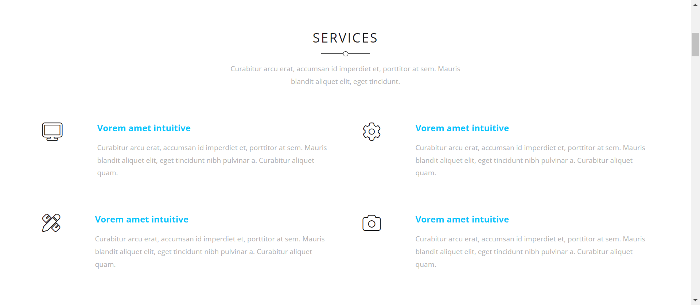
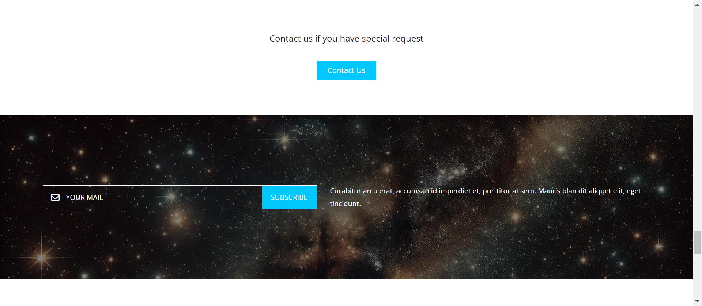

# Kasper | Template
- *Kasper* is a **responsive** website with a visually stunning design, crafted to adapt seamlessly across various screen sizes.
- This project is an implementation of a PSD design exists in the following link: https://www.graphberry.com/item/kasper-one-page-psd-template

## Live Demo
If you want to take a closer look at the webpage and check how responsive it is, please visit the following link: https://minaanis7.github.io/kasper-template/

## Screenshots
- Header and Landing Page
  
- Services Section
  
- Designs Information
  
- Portfolio Section
   &nbsp; &nbsp; 
- Section with Auto-Playing Video in the Background
  
- About Us Section
   &nbsp; &nbsp; 
- Testimonials and Our Skills Section
  
- Quote Section
  
- Pricing Section
   &nbsp; &nbsp; 
- Email Subscribtion
  
- Contact Us
  
- Footer
  

## Languages Use
- HTML
- CSS
